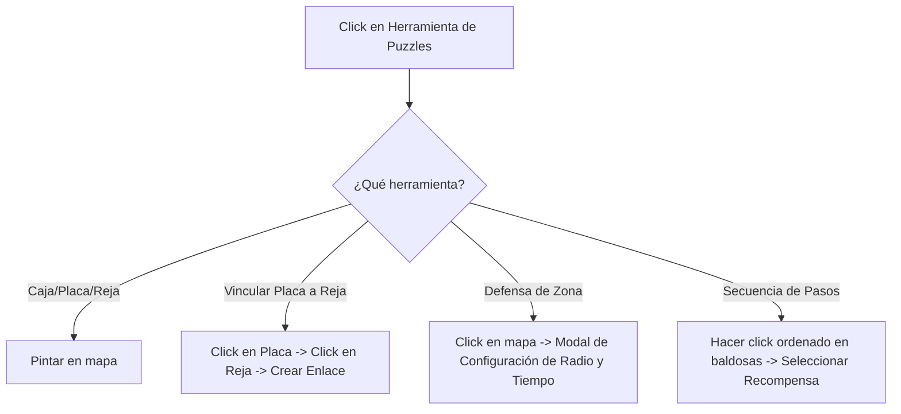

# Plan de Implementación: Mecánicas de Puzzle Interactivas en el Editor y el Motor

Este plan describe cómo incorporar 5 mecánicas de puzzle y modos de juego en el editor (`editor.html`) y el motor de juego (`Nivel_1.js` y clases asociadas). La configuración de todas las mecánicas será 100% visual y asistida mediante una interfaz interactiva de arrastrar, hacer clic o seleccionar coordenadas.

---

## Arquitectura de Datos del Paquete (`NIVEL_PACK`)
Añadiremos claves dedicadas dentro de cada objeto de mapa en `mapsOfPack`:
```typescript
interface SubMapa {
  matriz: number[][];
  enemigos: EnemigoConfig[];
  portales: PortalConfig[];
  cofres: CofreConfig[];
  
  // NUEVO: Estructura de Puzzles
  cajas?: { gridX: number; gridY: number }[];
  mecanismos?: { plateX: number; plateY: number; gateX: number; gateY: number }[];
  holdouts?: { gridX: number; gridY: number; radio: number; tiempo: number }[];
  lasers?: { gridX: number; gridY: number; dir: 'UP' | 'DOWN' | 'LEFT' | 'RIGHT' }[];
  espejos?: { gridX: number; gridY: number; angulo: 45 | 135 }[];
  receptores?: { gridX: number; gridY: number; gateX: number; gateY: number }[];
  secuencias?: { pasos: { x: number; y: number }[]; rewardX: number; rewardY: number }[];
}
```

---

## Propuesta de Nuevas Baldosas en `TilemapRenderer.js`
Añadiremos 3 nuevos tipos de baldosas para dar soporte a los elementos estáticos de los puzzles:
- **Placa de Presión (ID 23)**: Color `0xe1b12c`. Se activa cuando el jugador o una caja se posiciona encima.
- **Muro Conectado / Reja (ID 24)**: Color `0x2c3e50` (borde verde `0x44bd32`). Bloque sólido que cambia a transitable cuando su placa asociada se activa.
- **Láser Receptor (ID 25)**: Color `0x12cbc4`. Abre una reja asociada al ser golpeado por un haz de luz láser.

---

## 1. Diseño de la Interfaz del Editor (`editor.html`)

### Pestaña de Puzzles
Añadiremos una tercera pestaña lateral llamada **Puzzles** junto a *Baldosas* y *Enemigos*:
```
+------------------------------------+
|   Baldosas  |  Enemigos  | Puzzles |  <-- Nueva pestaña activa
+------------------------------------+
| [ ] Caja Sokoban (Objeto)          |
| [ ] Placa de Presión (ID 23)       |
| [ ] Reja Conectada (ID 24)         |
| [ ] Enlace Mecanismo (Vincular)    |
| [ ] Emisor Láser (Objeto)          |
| [ ] Espejo Reflector (Objeto)      |
| [ ] Receptor Láser (ID 25)         |
| [ ] Evento Defensa de Zona (Zona)  |
| [ ] Secuencia de Pasos (Simon)     |
+------------------------------------+
```

### Herramienta de Enlace Interactivo
Para facilitar el trabajo de los diseñadores sin experiencia en programación:
- **Vincular Placa/Reja**: Al seleccionar "Enlace Mecanismo", el diseñador hace clic en una Placa de Presión (ID 23) y luego hace clic en la Reja Conectada (ID 24). El editor dibuja una línea discontinua de color amarillo que conecta visualmente ambos elementos en el mapa para confirmar el enlace.
- **Vincular Receptor/Reja**: Similar al anterior, haciendo clic en el Receptor (ID 25) y luego en la Reja (ID 24), dibujando una línea discontinua cian.
- **Configurador de Evento Defensa**: Al hacer clic en el mapa para colocar el círculo de Defensa, se abre el modal `#modalHoldout` para configurar de manera visual el **Radio del círculo (de 1 a 5 bloques)** y el **Tiempo de supervivencia (de 10s a 120s)**.
- **Configurador de Secuencias**: Permite hacer clic en orden en varias celdas para definir la secuencia correcta de paso de Simon Dice y luego seleccionar la recompensa (ej. spawnear un cofre).



---

## 2. Lógica del Motor de Juego (`Nivel_1.js`, `PlayerControllator.js`)

### A. Sokoban (Cajas y Placas de Presión)
- En `PlayerController.update(dt)`:
  - Si el jugador se mueve en una dirección y colisiona contra una Caja (`cajas`):
    - Se calcula la celda adyacente en la dirección del empuje.
    - Si la celda adyacente está libre (no es pared, reja cerrada, otra caja o un enemigo), la caja se desplaza gradualmente hacia esa celda.
- En `Nivel_1.update()`:
  - En cada ciclo, se verifica si alguna placa de presión (ID 23) tiene una caja o al jugador encima de ella.
  - Si una placa está activada, su reja asociada (ID 24) se abre (`matriz[y][x] = 0` y se reduce su opacidad).
  - Si se libera la placa, la reja se vuelve a cerrar (`matriz[y][x] = 24` y vuelve a ser sólida).

### B. Inercia y Deslizamiento en Hielo
- En `PlayerController.calcularVelocidadActual()`:
  - Si el jugador está sobre una baldosa de **Hielo (ID 4)** y no está congelado:
    - Entra en "Modo Deslizamiento".
    - El controlador ignora el teclado y arrastra al jugador a velocidad constante en la misma dirección hasta chocar contra un bloque sólido o entrar a una baldosa de suelo normal.

### C. Defensa de Zona / Holdout
- En `Nivel_1.update()`:
  - Si el jugador entra en una zona de holdout:
    - Se activa un círculo rojo translúcido y una interfaz en pantalla: `"SECTOR INTRUSO: Sobrevive XX.Xs"`.
    - Las puertas de la sala se cierran (se configuran bloques sólidos temporales).
    - Los generadores de esqueletos incrementan su velocidad de spawning al doble.
    - Si el jugador resiste y el tiempo llega a cero, las puertas se abren y se genera un cofre con botín en el centro.

### D. Láseres y Espejos
- En `Nivel_1.update()`:
  - Se traza un rayo (línea recta) desde cada emisor láser.
  - Si el rayo choca con un **Espejo**, se dobla 90° según la orientación del espejo.
  - Si choca con el jugador, le inflige 4% de daño cada 0.5s.
  - Si choca con un **Receptor (ID 25)**, abre su reja asociada.
  - El jugador puede presionar **Espacio** cerca de un espejo para rotar su orientación en 90°.

### E. Simón Dice / Secuencia Rítmica
- Al ingresar a la sala del puzzle:
  - Las baldosas del patrón destellan en orden una sola vez.
  - El jugador debe caminarlas en la misma secuencia.
  - Si se equivoca, recibe una pequeña descarga de veneno y la secuencia se reinicia. Al completarlo con éxito, abre una puerta secreta o spawnea un cofre.

---

## Plan de Verificación y Control de Errores

### Pruebas en el Editor:
- Confirmar que al cambiar de pestaña a "Puzzles" la paleta de baldosas se filtre y muestre las opciones correctas.
- Validar visualmente los enlaces mediante renderizado de líneas de colores.
- Impedir guardar si existen placas de presión o receptores láser huérfanos (sin ninguna reja asociada).

### Pruebas en el Motor de Juego:
- Validar que las cajas Sokoban no atraviesen muros sólidos ni se solapen con otras cajas.
- Probar que el temporizador de la defensa de zona se detenga si el jugador muere.
- Confirmar que las rotaciones del espejo desvíen correctamente la trayectoria del rayo láser en tiempo de ejecución.
